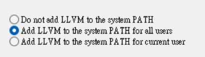

# Clang-format And Clang-tidy Manual Installation Guide

**Reference:**
https://releases.llvm.org

---

## Installation Steps

- **Version:** 20.1.0

1. **Download the installer**

   Visit the release page and download the Windows installer:

   - https://github.com/llvm/llvm-project/releases/tag/llvmorg-20.1.0
   - Select: `LLVM-20.1.0-win64.exe`

2. **Run the installer**

   Double-click the downloaded file and follow the setup instructions:

   

3. **(Optional) Verify the installation**

   Open a terminal and check the versions:

   ```
   clang-format --version
   ```

   ```
   clang-tidy --version
   ```

---